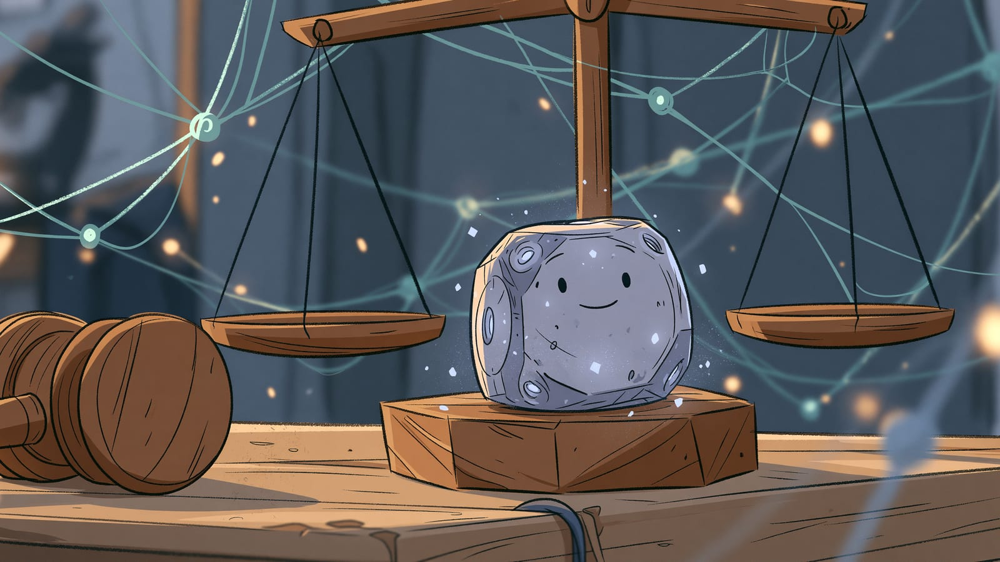

## AI a wartości i odpowiedzialność

Gdy technologia staje się tak potężna jak sztuczna inteligencja, nieodłącznie pojawiają się pytania o etykę, wartości i odpowiedzialność. W tym rozdziale pokazuję najważniejsze aspekty etyczne i prawne związane z rozwojem i wykorzystaniem systemów sztucznej inteligencji.

Zrozumienie tych zagadnień jest kluczowe nie tylko dla twórców AI, ale też dla Ciebie - jako użytkownika, obywatela i uczestnika cyfrowego świata.

## Kluczowe wyzwania etyczne w świecie AI

### Uprzedzenia i dyskryminacja

Jednym z najbardziej palących problemów etycznych związanych z AI jest kwestia uprzedzeń i dyskryminacji algorytmicznej. Systemy AI uczą się na danych historycznych, które często odzwierciedlają istniejące w społeczeństwie nierówności i uprzedzenia.

To trochę jak dziecko wychowywane w środowisku pełnym stereotypów - bez odpowiedniej korekty, zacznie powielać te same wzorce myślenia. Przykładowo, system AI analizujący CV kandydatów może faworyzować osoby o typowo męskich imionach do stanowisk technicznych, jeśli dane historyczne pokazują, że na tych stanowiskach pracowało więcej mężczyzn.

Rozwiązanie tego problemu wymaga nie tylko technicznych korekt (jak specjalne metody treningu i testowania systemów pod kątem stronniczości), ale też świadomości i odpowiedzialności ze strony twórców i użytkowników AI.

### Przejrzystość i wyjaśnialność

Współczesne systemy AI, szczególnie te oparte na głębokim uczeniu, często działają jak "czarne skrzynki" - trudno zrozumieć, w jaki dokładnie sposób dochodzą do konkretnych wniosków czy decyzji.

Wyobraź sobie sędziego, który wydaje wyrok, ale nie potrafi wyjaśnić swojego rozumowania. Trudno byłoby zaakceptować taki system w wymiarze sprawiedliwości, prawda? Podobnie, gdy AI podejmuje lub sugeruje decyzje wpływające na ludzkie życie - od oceny zdolności kredytowej po diagnostykę medyczną - brak przejrzystości staje się poważnym problemem etycznym.

Wiele organizacji i badaczy pracuje nad metodami zwiększenia wyjaśnialności AI, takimi jak "Explainable AI" (XAI) czy "interpretable machine learning". Celem jest stworzenie systemów, których działanie można zrozumieć i zweryfikować - nawet jeśli są skomplikowane.

### Prywatność danych

Systemy AI potrzebują ogromnych ilości danych do treningu i działania, co rodzi poważne pytania o prywatność: jak dane są zbierane, do czego wykorzystywane i jak długo przechowywane.

:::note[Szczegółowy poradnik]
Praktyczne informacje o tym, jak firmy AI wykorzystują Twoje dane, jak wyłączyć trening na Twoich rozmowach, techniki anonimizacji oraz pełną checklistę RODO znajdziesz w rozdziale [Prywatność i dane](/etyka/prywatnosc/).
:::

### Autonomia człowieka i kontrola

W miarę jak systemy AI stają się coraz bardziej zaawansowane i autonomiczne, pojawia się pytanie o granice ich decyzyjności i kontrolę człowieka nad technologią.

Pomyśl o samochodach autonomicznych - kto powinien decydować w sytuacji nieuniknionego wypadku? Czy algorytm może ważyć ludzkie życie? A jeśli tak, według jakich kryteriów? Co z systemami militarnymi opartymi na AI - czy powinny móc samodzielnie decydować o użyciu siły?

Zasada "human-in-the-loop" (człowiek w pętli decyzyjnej) sugeruje, że krytyczne decyzje powinny zawsze wymagać ludzkiego zatwierdzenia. Jednak w praktyce granica między "krytycznymi" a "rutynowymi" decyzjami nie zawsze jest oczywista.

## Aspekty prawne i regulacyjne AI

### Rozwijający się krajobraz regulacyjny

Regulatorzy na całym świecie próbują nadążyć za szybkim rozwojem sztucznej inteligencji, tworząc nowe przepisy lub adaptując istniejące do nowych wyzwań.

Unia Europejska przoduje w tym obszarze z [AI Act](https://artificialintelligenceact.eu/) - kompleksowym aktem prawnym regulującym systemy sztucznej inteligencji według stopnia ryzyka, jakie stwarzają. AI Act wszedł w życie 1 sierpnia 2024 r. i jest wdrażany etapami. Od 2 sierpnia 2026 r. zaczną obowiązywać [wymogi przejrzystości](https://datamatters.sidley.com/2026/06/24/eu-ai-act-transparency-obligations-preparing-for-compliance-by-2-august-2026/) - m.in. jasna informacja, że rozmawiasz z AI, a nie z człowiekiem, oraz oznaczanie treści wygenerowanych przez AI. Wymogi dla systemów wysokiego ryzyka (np. AI w rekrutacji, biometrii czy wyrobach medycznych) [przesunięto w maju 2026 r. pakietem Digital Omnibus](https://www.traverssmith.com/knowledge/knowledge-container/eu-agrees-to-delay-key-ai-act-compliance-deadlines/) na 2 grudnia 2027 r. i 2 sierpnia 2028 r. Stany Zjednoczone przyjmują bardziej sektorowe podejście, z różnymi regulacjami dla AI w medycynie, finansach czy transporcie.

Warto śledzić ten rozwijający się krajobraz regulacyjny, szczególnie jeśli wykorzystujesz AI w pracy lub biznesie. Co było dozwolone wczoraj, może wymagać specjalnych zabezpieczeń lub certyfikacji jutro.

### Odpowiedzialność i własność intelektualna

Kto ponosi odpowiedzialność, gdy system AI podejmie błędną decyzję, która wyrządzi szkodę? Projektant systemu? Firma, która go wdrożyła? Użytkownik końcowy? A może sam system AI (choć trudno wyobrazić sobie pozwanie algorytmu)?

Ten sam problem widać w motoryzacji - kto odpowiada za wypadek spowodowany przez autonomiczny samochód? Kierowca, który nie przejął kontroli? Producent samochodu? Twórca oprogramowania? To pytania, na które systemy prawne dopiero szukają odpowiedzi.

Równie złożone są kwestie własności intelektualnej. Czy treści generowane przez AI (tekst, obrazy, muzyka) mogą być chronione prawem autorskim? Jeśli tak, kto jest ich autorem? A co z wykorzystaniem materiałów chronionych prawem autorskim do treningu modeli AI?

### AI a prawa człowieka

Systemy AI mogą wpływać na fundamentalne prawa człowieka - od prywatności, przez wolność wypowiedzi, po prawo do niedyskryminacji. W niektórych przypadkach mogą je wzmacniać (np. zwiększając dostęp do edukacji czy opieki zdrowotnej), w innych - zagrażać im (np. poprzez masową inwigilację czy automatyzację cenzury).

ONZ, [UNESCO](https://www.unesco.org/en/artificial-intelligence/recommendation-ethics) i inne organizacje międzynarodowe pracują nad wytycznymi dotyczącymi AI zgodnej z prawami człowieka. W listopadzie 2021 r. powstała pierwsza globalna _Rekomendacja w sprawie etyki sztucznej inteligencji_ UNESCO, przyjęta przez 193 państwa. Organizacje te podkreślają, że prawa człowieka powinny być kompasem moralnym ukierunkowującym rozwój i wykorzystanie AI.

## Dobre praktyki etyczne w korzystaniu z AI

Jako użytkownik AI, nawet jeśli nie tworzysz tych systemów, masz wpływ na to, jak technologia ta jest wykorzystywana. Oto kilka praktyk, które uważam za podstawowe:

**Świadomość ograniczeń.** Etyczne korzystanie z AI zaczyna się od zrozumienia jej ograniczeń. Wiedz, że systemy AI mogą się mylić, powielać uprzedzenia czy generować szkodliwe treści. Nie traktuj ich wyników jako niepodważalnej prawdy, szczególnie w kwestiach mających istotny wpływ na ludzi. Dotyczy to zarówno wykorzystania AI w pracy (np. przy rekrutacji czy ocenie pracowników), jak i w życiu osobistym (np. poleganie na AI w kwestiach zdrowotnych bez konsultacji z lekarzem).

**Przejrzystość w korzystaniu z AI.** Jeśli wykorzystujesz AI do tworzenia treści - czy to tekstów, obrazów czy muzyki - dobrą praktyką jest informowanie o tym odbiorców. Nie chodzi o przepraszanie za korzystanie z nowych narzędzi, ale o uczciwość i przejrzystość. Podobnie, jeśli prowadzisz firmę używającą AI do interakcji z klientami (np. chatboty) lub analizy ich danych, jasno informuj o tym w polityce prywatności i warunkach korzystania z usług.

**Poszanowanie praw autorskich.** Choć modele generatywne AI potrafią tworzyć treści przypominające dzieła konkretnych artystów czy autorów, etyczne podejście wymaga poszanowania oryginalnej twórczości. Unikaj używania AI do imitowania stylu żyjących twórców bez ich zgody, szczególnie w celach komercyjnych. Jeśli inspirujesz się czyimś stylem, rozważ wymienienie go jako źródła inspiracji.

**Równowaga między automatyzacją a ludzkim kontaktem.** AI może automatyzować wiele zadań, ale nie zawsze powinna. W niektórych kontekstach - jak opieka zdrowotna, edukacja czy wsparcie w kryzysie - ludzki kontakt i empatia są niezastąpione. Rozważ, czy w Twojej sytuacji całkowita automatyzacja jest rzeczywiście najlepszym rozwiązaniem, czy może hybrydowe podejście (AI wspomagające ludzi, a nie zastępujące ich) byłoby bardziej etyczne i skuteczne.

## AI for Good - pozytywne zastosowania

Mimo wielu wyzwań etycznych, AI ma również realny potencjał do czynienia dobra. Sztuczna inteligencja wspiera dziś monitoring środowiska i modelowanie klimatu, odkrywanie leków i diagnostykę obrazową, a także personalizację nauczania i dostępność treści dla osób z niepełnosprawnościami.

Traktuj tę listę jako kierunkowskaz, nie jako dowód. Każde z tych zastosowań ma swoje ograniczenia, a skuteczność konkretnego wdrożenia trzeba oceniać osobno - po opublikowanych wynikach, nie po deklaracjach twórców.

<!-- TODO(Łukasz): uzupełnić o 2-3 konkretne projekty z nazwami, liczbami i linkami do badań lub raportów wdrożeń - obecnie sekcja jest ogólnikowa -->

## Podsumowanie

Kluczowe jest zachowanie równowagi - ani bezkrytyczny entuzjazm, ani paraliżujący lęk przed nową technologią nie służą jej odpowiedzialnemu rozwojowi. Moim zdaniem cały ten rozdział da się sprowadzić do trzech pytań, które warto zadać przy każdym systemie AI: na jakich danych został wytrenowany, kto odpowiada za jego decyzje i czy człowiek może te decyzje cofnąć.

## Źródła i dalsze lektury

- [EU AI Act](https://artificialintelligenceact.eu/) - pełny tekst i harmonogram wdrażania europejskiego rozporządzenia o sztucznej inteligencji
- [UNESCO Recommendation on the Ethics of AI (2021)](https://www.unesco.org/en/artificial-intelligence/recommendation-ethics) - pierwsza globalna rekomendacja etyczna dot. AI, przyjęta przez 193 państwa
- [Stanford HAI AI Index Report](https://hai.stanford.edu/research/ai-index-report) - coroczny raport o stanie AI, w tym sekcje o etyce, regulacjach i wpływie społecznym
- [OECD AI Policy Observatory](https://www.oecd.org/en/topics/sub-issues/artificial-intelligence.html) - przegląd polityk AI w krajach OECD, w tym zasady odpowiedzialnej AI

:::note[Teraz wiesz]

- Jakie są główne wyzwania etyczne AI: uprzedzenia algorytmiczne, problem "czarnej skrzynki", prywatność danych i autonomia człowieka
- Jak wygląda krajobraz regulacyjny - od EU AI Act po kwestie odpowiedzialności prawnej i własności intelektualnej
- Jak etycznie korzystać z AI na co dzień: świadomość ograniczeń, przejrzystość, poszanowanie praw autorskich i równowaga automatyzacji z ludzkim kontaktem

**Następny krok:** [Prywatność i dane w AI](/etyka/prywatnosc/) - dowiesz się, jak firmy AI wykorzystują Twoje dane, jak wyłączyć trening na Twoich rozmowach i jak chronić poufne informacje.
:::
