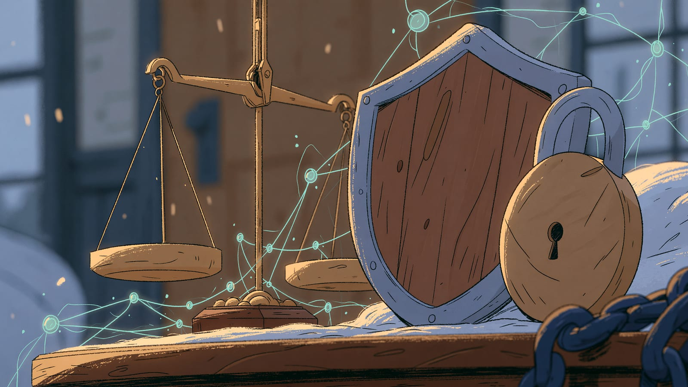

import { CardGrid, LinkCard } from '@astrojs/starlight/components';

## Czego się tu nauczysz

Ta sekcja bywa pomijana, a jest jedną z ważniejszych. Nie chodzi w niej o moralizowanie, tylko o rzeczy, które mają bezpośrednie konsekwencje: co możesz wkleić do chatbota, a czego nie; kiedy odpowiedź AI może być systematycznie stronnicza; jakie regulacje zaczynają obowiązywać i co z nich wynika dla zwykłego użytkownika.

Pierwszy artykuł zajmuje się etyką i prawem łącznie, bo w praktyce trudno je rozdzielić. Uprzedzenia algorytmów, przejrzystość decyzji, odpowiedzialność za błąd maszyny, prawa autorskie do treści generowanych - i regulacje, które próbują to wszystko uporządkować.

Drugi to prywatność i dane. Tu robi się najbardziej praktycznie: polityki danych firm AI, RODO w kontekście narzędzi AI, anonimizacja, bezpieczeństwo informacji firmowych. Jeśli pracujesz z danymi osobowymi, ten artykuł jest obowiązkowy.

Trzeci patrzy do przodu - AGI, prognozy ekspertów, scenariusze rozwoju. Napisany tak, żeby oddzielić to, co wiemy, od tego, co jest przewidywaniem, i żeby nie zostawiać Cię ani w panice, ani w fałszywym spokoju.

## Dla kogo to jest

Dla wszystkich, ale szczególnie dla osób pracujących z danymi innych ludzi: nauczycieli, lekarzy, prawników, HR, właścicieli firm. Jeśli wprowadzasz AI w organizacji, ta sekcja jest ważniejsza niż przegląd narzędzi.

## W jakiej kolejności czytać

Po kolei. Trzy artykuły układają się od najbardziej praktycznych do najbardziej spekulatywnych. Jeśli masz czas tylko na jeden i korzystasz z AI zawodowo - wybierz "Prywatność i dane w AI".

## Czego tu nie ma

Nie ma tu porady prawnej. Przepisy dotyczące AI zmieniają się szybko i różnią się między krajami - w sprawach o realnych konsekwencjach prawnych sprawdź aktualny stan u źródła albo skonsultuj się z prawnikiem.

## Artykuły w tej sekcji

<CardGrid>
	<LinkCard
		title="Etyka i prawo w świecie AI"
		description="Uprzedzenia algorytmów, przejrzystość, odpowiedzialność i regulacje."
		href="/etyka/etyczne-aspekty/"
	/>
	<LinkCard
		title="Prywatność i dane w AI"
		description="Polityki danych firm AI, RODO, anonimizacja i bezpieczeństwo informacji."
		href="/etyka/prywatnosc/"
	/>
	<LinkCard
		title="Przyszłość AI"
		description="AGI, trendy, prognozy ekspertów i scenariusze rozwoju."
		href="/etyka/przyszlosc-ai/"
	/>
</CardGrid>

:::note[Następny krok]
**Zacznij tutaj:** [Etyka i prawo w świecie AI](/etyka/etyczne-aspekty/) - poznasz najważniejsze wyzwania etyczne i rozwijające się regulacje.
:::
