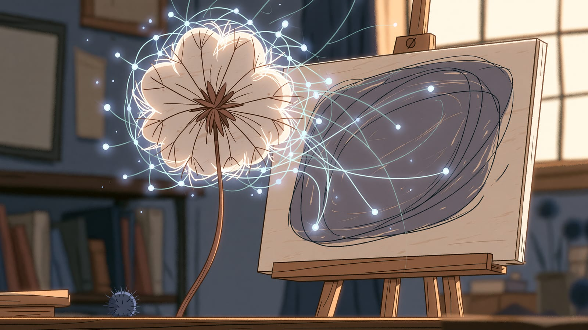

<!-- TODO(Łukasz): ceny i wersje w tym pliku pochodzą z 2024/2025 - zweryfikuj u dostawców przed publikacją -->

## Tworzenie obrazów ze słów

Generatory obrazów AI to narzędzia, które tworzą obrazy na podstawie opisów tekstowych. Wystarczy napisać, co chcesz zobaczyć, a AI wygeneruje obraz. Pokażę Ci trzy narzędzia, o które pytają mnie najczęściej, realne różnice między nimi oraz to, co w nich frustruje początkujących - bo o tym w opisach producentów nie przeczytasz.

## Midjourney

**Midjourney** to jeden z najpopularniejszych generatorów obrazów, słynący z artystycznej jakości i estetyki.

**Dostęp i ceny:** Basic ($10/miesiąc, ~200 obrazów), Standard ($30/miesiąc, 15h szybkiego generowania), Pro ($60/miesiąc, 30h, tryb stealth), Mega ($120/miesiąc, 60h).

**Jak używać:** Midjourney działa przez Discord. Wpisujesz `/imagine` i opisujesz, co chcesz zobaczyć.

:::tip[Zalety]
Bardzo dopracowane estetycznie kadry, rozpoznawalny styl, aktywna społeczność.
:::

:::caution[Wady]
Wymaga Discorda, brak darmowej wersji, trudniejsze precyzyjne kontrolowanie.
:::

## DALL-E 3 (OpenAI)

**DALL-E 3** to generator obrazów od OpenAI, zintegrowany z ChatGPT.

**Dostęp:** ChatGPT Plus ($20/miesiąc, w ramach subskrypcji), Microsoft Copilot (darmowy, ograniczone użycie), API ($0.04-0.12 za obraz).

**Kluczowe cechy:** świetne rozumienie promptów w języku naturalnym, dokładne podążanie za instrukcjami, dobry tekst na obrazach, integracja z ChatGPT (możesz prowadzić rozmowę o obrazie).

:::tip[Zalety]
Dokładnie realizuje złożone polecenia opisane zwykłym językiem, łatwy dostęp (ChatGPT), dobry tekst w obrazach.
:::

:::caution[Wady]
Mniej artystyczny niż Midjourney, ograniczenia treści, wymaga subskrypcji.
:::

## Stable Diffusion

**Stable Diffusion** to open-source'owy generator, który możesz uruchomić lokalnie na swoim komputerze.

**Dostęp:** lokalnie (darmowy, wymaga dobrej karty graficznej), online (przez platformy jak DreamStudio, Leonardo.ai).

**Zalety modelu open-source:** pełna kontrola i prywatność, możliwość dostrojenia do swoich potrzeb, brak ograniczeń treści (lokalna wersja), tysiące modeli społeczności (Civitai).

:::tip[Zalety]
Darmowy, prywatny, ogromna elastyczność, aktywna społeczność.
:::

:::caution[Wady]
Wymaga wiedzy technicznej, potrzebny mocny komputer, krzywa uczenia.
:::

## Inne popularne generatory

**Leonardo.ai** - przyjazna platforma oparta na Stable Diffusion z darmowym planem. Cena: darmowy (150 kredytów/dzień) / od $12/miesiąc. Najlepsze dla: początkujący, concept art, game design.

**Adobe Firefly** - generator od Adobe, zintegrowany z Photoshop i innymi aplikacjami Creative Cloud. Cena: w ramach subskrypcji Adobe. Najlepsze dla: profesjonaliści używający Adobe, komercyjne użycie.

**Ideogram** - generator nastawiony na czytelny tekst wewnątrz obrazu (napisy, logo, plakaty). Cena: darmowy (25 promptów/dzień) / od $7/miesiąc. Najlepsze dla: grafiki z tekstem, logo, plakaty.

**Canva AI / Magic Studio** - generowanie obrazów zintegrowane z popularnym narzędziem do projektowania. Cena: w ramach Canva Pro ($12.99/miesiąc). Najlepsze dla: marketing, social media, szybkie projekty.

## Porównanie generatorów

| Generator | Jakość | Łatwość | Cena startu | Najlepsze dla |
| --- | --- | --- | --- | --- |
| **Midjourney** | Bardzo dobra (artystyczna) | Średnia | $10/mies | Sztuka, estetyka |
| **DALL-E 3** | Bardzo dobra | Bardzo łatwa | $20/mies* | Ogólne, precyzja |
| **Stable Diffusion** | Dobra-Świetna | Trudna | Darmowy | Kontrola, prywatność |
| **Leonardo.ai** | Dobra | Łatwa | Darmowy | Początkujący |
| **Ideogram** | Dobra | Łatwa | Darmowy | Tekst na obrazach |

<small>*DALL-E 3 w ramach ChatGPT Plus</small>

## Podstawy pisania promptów do obrazów

Zanim zaczniesz obwiniać narzędzie za słaby efekt, sprawdź prompt. Zwróć uwagę na kolejność - modele przywiązują większą wagę do tego, co napiszesz na początku, więc temat stawiaj przed stylistyką.

**Struktura dobrego promptu:**

```text
[Temat], [Styl], [Detale], [Oświetlenie], [Kolorystyka], [Jakość]
```

**Przykład:**

```text
A majestic lion standing on a cliff at sunset,
digital art style, detailed fur, dramatic lighting,
warm orange and purple colors, 8k, highly detailed
```

**Przydatne słowa kluczowe:** jakość (8k, highly detailed, masterpiece, professional), style (digital art, oil painting, watercolor, photography, anime), oświetlenie (dramatic lighting, soft light, golden hour, studio lighting), perspektywa (close-up, wide angle, bird's eye view, portrait).

## Aspekty prawne

:::caution[Prawa autorskie]
Status prawny obrazów AI jest wciąż niejasny. Większość platform pozwala na komercyjne użycie, ale sprawdź warunki konkretnego narzędzia. Obrazy generowane przez AI mogą nie być chronione prawem autorskim w niektórych jurysdykcjach.
:::

## Podsumowanie

- **Midjourney** - dopracowana estetyka, dostęp przez Discord
- **DALL-E 3** - wierne odwzorowanie złożonych promptów, w ChatGPT
- **Stable Diffusion** - open-source, pełna kontrola, darmowy lokalnie
- **Leonardo.ai** - przyjazny dla początkujących, darmowy plan
- **Ideogram** - czytelny tekst wewnątrz obrazu

<!-- TODO(Łukasz): tu zadziałałaby anegdota - którego generatora używasz do materiałów na stronę i dlaczego odpadły pozostałe? -->
<!-- TODO(Łukasz): przydałby się jeden Twój realny prompt z efektem "przed/po" - to najlepiej uczy struktury opisanej wyżej -->

:::note[Teraz wiesz]

- Czym różnią się Midjourney (artystyczna jakość), DALL-E 3 (precyzja promptów) i Stable Diffusion (open-source, pełna kontrola)
- Jak budować skuteczne prompty do obrazów: temat, styl, detale, oświetlenie, kolorystyka i jakość
- Na co uważać pod względem praw autorskich przy komercyjnym wykorzystaniu obrazów generowanych przez AI

**Następny krok:** [Narzędzia AI do pisania](/narzedzia/pisanie/) - poznasz Jasper, Copy.ai, Writesonic i narzędzia SEO, które pomogą Ci tworzyć treści szybciej i lepiej.
:::
