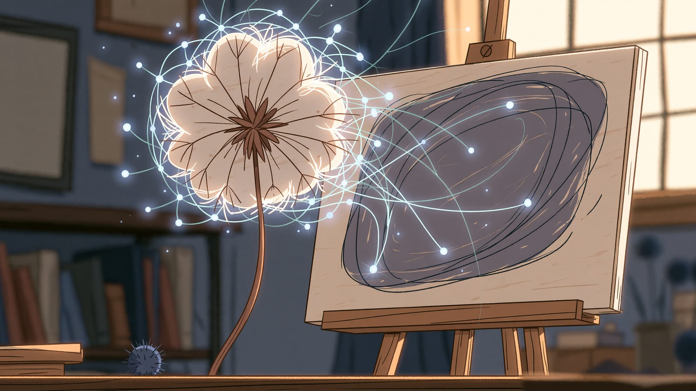

## Tworzenie obrazów ze słów

Generatory obrazów AI to narzędzia, które tworzą obrazy na podstawie opisów tekstowych. Wystarczy napisać, co chcesz zobaczyć, a AI wygeneruje obraz. Pokażę Ci narzędzia, o które pytają mnie najczęściej, realne różnice między nimi oraz to, co w nich frustruje początkujących - bo o tym w opisach producentów nie przeczytasz.

:::note[Dlaczego nie znajdziesz tu cen]
Modele i plany w tej kategorii zmieniają się szczególnie szybko. Przy każdym narzędziu piszę więc, czy ma plan darmowy, i linkuję do cennika u dostawcy. Za co się w ogóle płaci przy AI, tłumaczę w rozdziale [Ile kosztuje AI](/narzedzia/ile-kosztuje-ai/).
:::

## Midjourney

**Midjourney** to jeden z najpopularniejszych generatorów obrazów, słynący z artystycznej jakości i estetyki. Aktualna generacja modelu to linia V8.

**Dostęp:** aplikacja webowa na midjourney.com, opcjonalnie także Discord. Nie ma planu darmowego. [Cennik](https://www.midjourney.com/plans).

:::note[Discord nie jest już obowiązkowy]
Przez lata Midjourney działało wyłącznie przez Discorda i to zniechęcało najwięcej osób. Dziś głównym interfejsem jest zwykła strona internetowa, na którą zalogujesz się kontem Google. Discord nadal działa, ale nie musisz go instalować.
:::

**Jak używać:** opisujesz obraz w oknie promptu, dostajesz cztery propozycje, wybraną powiększasz lub przerabiasz w wariantach. Plan kupuje w praktyce czas obliczeniowy, a nie liczbę obrazów.

:::tip[Zalety]
Bardzo dopracowane estetycznie kadry, rozpoznawalny styl, aktywna społeczność, generowanie krótkiego wideo z obrazu.
:::

:::caution[Wady]
Brak darmowej wersji, trudniejsze precyzyjne kontrolowanie szczegółów, styl potrafi "przykryć" Twoje intencje.
:::

## GPT Image (OpenAI)

**GPT Image** to generator obrazów wbudowany w ChatGPT - następca wycofanego DALL-E. Aktualna wersja to GPT Image 2.

**Dostęp:** w ChatGPT we wszystkich planach, w darmowym z ograniczeniami; także przez API. [Cennik](https://openai.com/chatgpt/pricing/).

**Kluczowe cechy:** świetne rozumienie promptów w języku naturalnym, dokładne podążanie za instrukcjami, dobry tekst na obrazach, integracja z rozmową (możesz poprosić o poprawkę zwykłym zdaniem, zamiast pisać prompt od nowa).

:::caution[DALL-E to już historia]
Jeśli w poradnikach albo w starszych artykułach widzisz "DALL-E 3", masz do czynienia z nieaktualną treścią. OpenAI ogłosiło wycofanie DALL-E 2 i DALL-E 3 w listopadzie 2025, a w maju 2026 modele zniknęły z API. W ChatGPT zastąpiła je linia GPT Image.
:::

:::tip[Zalety]
Dokładnie realizuje złożone polecenia opisane zwykłym językiem, najniższy próg wejścia ze wszystkich narzędzi w tym rozdziale, dobry tekst w obrazach.
:::

:::caution[Wady]
Mniej artystyczny niż Midjourney, ograniczenia treści, w planie darmowym wolniejszy i limitowany.
:::

## Stable Diffusion i FLUX

**Stable Diffusion** to open-source'owy generator, który możesz uruchomić lokalnie na swoim komputerze. Aktualna wersja to Stable Diffusion 3.5 (w wariantach Large, Turbo i Medium).

**FLUX** od Black Forest Labs to dziś druga - a często mocniejsza - opcja w świecie otwartych modeli obrazu. Rozlicza się za wygenerowany obraz, bez abonamentu. [Cennik](https://bfl.ai/pricing).

**Dostęp:** lokalnie (darmowy, wymaga dobrej karty graficznej) albo online przez platformy pośredniczące.

**Zalety modelu open-source:** pełna kontrola i prywatność, możliwość dostrojenia do swoich potrzeb, brak ograniczeń treści w wersji lokalnej, tysiące modeli społeczności.

:::caution[Uwaga na fałszywe wersje]
W sieci krążą artykuły o "Stable Diffusion 4". Taki model nie istnieje - to powielana dezinformacja. Najnowsza oficjalna wersja Stability AI to Stable Diffusion 3.5. Zanim uwierzysz w numer wersji, sprawdź go na stronie producenta.
:::

:::tip[Zalety]
Darmowy lokalnie, prywatny, ogromna elastyczność, aktywna społeczność.
:::

:::caution[Wady]
Wymaga wiedzy technicznej, potrzebny mocny komputer, krzywa uczenia.
:::

## Inne popularne generatory

**Gemini (Google)** - generowanie obrazów wbudowane w chatbota Google, pod nazwą Nano Banana. Ma plan darmowy. Najlepsze dla: szybkie obrazy bez zakładania kolejnego konta. [Cennik](https://gemini.google/subscriptions/).

**Leonardo.ai** - przyjazna platforma z darmowym planem, od 2024 roku należąca do Canvy. Obok własnych modeli udostępnia modele innych dostawców. Najlepsze dla: początkujący, concept art, game design. [Cennik](https://leonardo.ai/pricing/).

**Adobe Firefly** - generator od Adobe zintegrowany z Creative Cloud, dziś raczej wielomodelowe studio niż pojedynczy generator. Ma plan darmowy. Najlepsze dla: profesjonaliści używający Adobe, komercyjne użycie. [Cennik](https://www.adobe.com/products/firefly/plans.html).

**Ideogram** - generator nastawiony na czytelny tekst wewnątrz obrazu (napisy, logo, plakaty); od wersji 4.0 model ma otwarte wagi. Ma plan darmowy. Najlepsze dla: grafiki z tekstem, logo, plakaty. [Cennik](https://about.ideogram.ai/pricing).

**Canva (Magic Studio)** - generowanie obrazów zintegrowane z popularnym narzędziem do projektowania. Ma plan darmowy. Najlepsze dla: marketing, social media, szybkie projekty. [Cennik](https://www.canva.com/pricing/).

## Porównanie generatorów

| Generator | Jakość | Łatwość | Plan darmowy | Najlepsze dla |
| --- | --- | --- | --- | --- |
| **Midjourney** | Bardzo dobra (artystyczna) | Średnia | Nie | Sztuka, estetyka |
| **GPT Image (ChatGPT)** | Bardzo dobra | Bardzo łatwa | Tak (z limitami) | Ogólne, precyzja |
| **Gemini (Nano Banana)** | Bardzo dobra | Bardzo łatwa | Tak | Szybkie obrazy |
| **Stable Diffusion / FLUX** | Dobra-Świetna | Trudna | Tak (lokalnie) | Kontrola, prywatność |
| **Leonardo.ai** | Dobra | Łatwa | Tak | Początkujący |
| **Ideogram** | Dobra | Łatwa | Tak | Tekst na obrazach |

:::note[Granica obraz-wideo się zaciera]
Warto o tym wiedzieć, wybierając narzędzie na dłużej: te same platformy generują dziś obraz i wideo, a część z nich hostuje modele konkurencji obok własnych. Midjourney animuje obrazy, Google ma Veo, a Runway czy Adobe udostępniają cudze modele u siebie. Narzędzia do wideo opisuję w [Specjalistycznych narzędziach AI](/narzedzia/specjalistyczne/).
:::

## Podstawy pisania promptów do obrazów

Zanim zaczniesz obwiniać narzędzie za słaby efekt, sprawdź prompt. Zwróć uwagę na kolejność - modele przywiązują większą wagę do tego, co napiszesz na początku, więc temat stawiaj przed stylistyką.

**Struktura dobrego promptu:**

```text
[Temat], [Styl], [Detale], [Oświetlenie], [Kolorystyka], [Jakość]
```

**Przykład:**

```text
A majestic lion standing on a cliff at sunset,
digital art style, detailed fur, dramatic lighting,
warm orange and purple colors, 8k, highly detailed
```

**Przydatne słowa kluczowe:** jakość (8k, highly detailed, masterpiece, professional), style (digital art, oil painting, watercolor, photography, anime), oświetlenie (dramatic lighting, soft light, golden hour, studio lighting), perspektywa (close-up, wide angle, bird's eye view, portrait).

## Aspekty prawne

:::caution[Prawa autorskie]
Status prawny obrazów AI jest wciąż niejasny. Większość platform pozwala na komercyjne użycie, ale sprawdź warunki konkretnego narzędzia. Obrazy generowane przez AI mogą nie być chronione prawem autorskim w niektórych jurysdykcjach.
:::

## Podsumowanie

- **Midjourney** - dopracowana estetyka, dziś dostępny przez zwykłą stronę, bez planu darmowego
- **GPT Image** - wierne odwzorowanie złożonych promptów, w ChatGPT; następca DALL-E
- **Stable Diffusion / FLUX** - open-source, pełna kontrola, darmowe lokalnie
- **Leonardo.ai** - przyjazny dla początkujących, darmowy plan
- **Ideogram** - czytelny tekst wewnątrz obrazu

<!-- TODO(Łukasz): tu zadziałałaby anegdota - którego generatora używasz do materiałów na stronę i dlaczego odpadły pozostałe? -->
<!-- TODO(Łukasz): przydałby się jeden Twój realny prompt z efektem "przed/po" - to najlepiej uczy struktury opisanej wyżej -->

:::note[Teraz wiesz]

- Czym różnią się Midjourney (artystyczna jakość), GPT Image (precyzja promptów) i Stable Diffusion z FLUX-em (open-source, pełna kontrola)
- Że DALL-E został wycofany, a jego następcą w ChatGPT jest linia GPT Image
- Jak budować skuteczne prompty do obrazów: temat, styl, detale, oświetlenie, kolorystyka i jakość
- Na co uważać pod względem praw autorskich przy komercyjnym wykorzystaniu obrazów generowanych przez AI

**Następny krok:** [Narzędzia AI do pisania](/narzedzia/pisanie/) - poznasz narzędzia, które pomogą Ci tworzyć treści szybciej i lepiej.
:::
