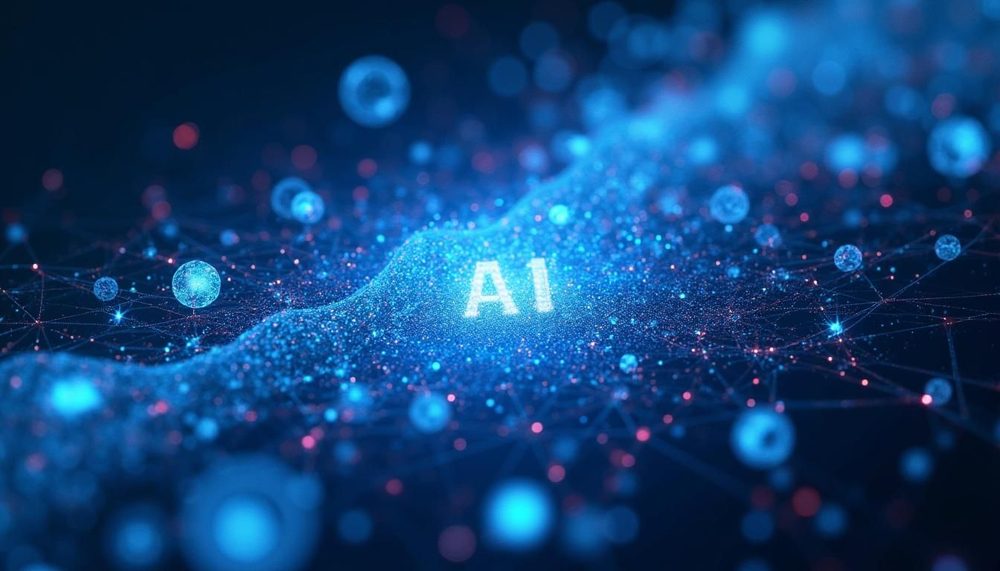

## Czym jest sztuczna inteligencja?

Sztuczna inteligencja – brzmi poważnie i futurystycznie, prawda? 🤖 Możliwe, że kojarzy Ci się z filmami sci-fi albo supermądrymi robotami. A tymczasem z AI spotykasz się na co dzień, nawet jeśli nie zdajesz sobie z tego sprawy! To trochę jak z elektrycznością: nie musisz rozumieć wszystkich szczegółów, żeby korzystać z jej dobrodziejstw. Zanim jednak zagłębimy się w szczegóły, pogadajmy na luzie o tym, czym tak naprawdę jest AI i dlaczego ostatnio wszędzie o niej głośno.

## Komputer myślący po ludzku?

Najprościej mówiąc, sztuczna inteligencja (AI) to sposób, by komputer myślał odrobinę bardziej po ludzku. Oczywiście komputery nie myślą tak jak my – nie mają uczuć ani własnej wyobraźni – ale można je zaprogramować tak, by radziły sobie z zadaniami, które normalnie wymagają ludzkiej inteligencji. Wyobraź sobie, że uczysz maszynę rozpoznawać wzory i podejmować decyzje: na przykład pokazujesz programowi tysiące zdjęć kotów i psów, żeby potem potrafił stwierdzić, na którym zdjęciu jest kot, a na którym pies. To właśnie jest esencja AI – tworzenie programu, który uczy się na podstawie danych i doświadczenia. Nie magia, a sprytne algorytmy (czyli przepisy dla komputera) i mnóstwo przykładów, dzięki którym komputer może się czegoś nauczyć.

## AI w codziennym życiu

Na co dzień AI pomaga nam w wielu miejscach, często zupełnie niezauważalnie:

- **Smartfony i asystenci głosowi:** Gdy pytasz Siri czy Asystenta Google o pogodę, to AI stara się zrozumieć Twoje pytanie i znaleźć odpowiedź. Podobnie działa funkcja autokorekty tekstu – telefon domyśla się, co chciałeś napisać.
- **Rekomendacje w internecie:** Kiedy Netflix podpowiada Ci kolejny serial, albo sklep internetowy sugeruje produkt, który może Ci się spodobać – to AI analizuje, co lubisz na podstawie wcześniejszych wyborów i próbuje zgadnąć, co chętnie zobaczysz lub kupisz.
- **Tłumaczenia i filtrowanie spamu:** Korzystasz z Google Translate albo masz w skrzynce pocztowej filtr spamu? To również zasługa AI. Program nauczył się mnóstwa przykładów, dzięki czemu całkiem nieźle tłumaczy zdania i odróżnia zwykły e-mail od natrętnej reklamy.
- **Biznes i analityka:** Firmy wykorzystują AI do analizy dużych zbiorów danych, przewidywania trendów rynkowych, optymalizacji procesów logistycznych czy nawet do automatyzacji obsługi klienta. Dzięki AI przedsiębiorstwa mogą podejmować lepsze decyzje biznesowe oparte na danych i działać efektywniej.

## Generatywna AI – nowy poziom kreatywności

To wszystko są przykłady sztucznej inteligencji. Ale pewnie zauważyłeś, że ostatnio w rozmowach o AI szczególnie często pojawiają się przykłady typu „program, który sam coś tworzy". I tu dochodzimy do pojęcia, które mogło Ci się obić o uszy: generatywna sztuczna inteligencja (z ang. generative AI, w skrócie często GenAI). Co to takiego? To po prostu AI, która potrafi generować nowe treści – wymyśla teksty, rysuje obrazy, komponuje muzykę, tworzy nowe pomysły na podstawie tego, czego ją nauczono. Na przykład program ChatGPT potrafi z Tobą rozmawiać i odpowiadać na pytania całymi zdaniami, jakby pisał człowiek. Inne programy generatywne tworzą obrazy na podstawie opisu (wpisujesz „kot grający na gitarze w kosmosie", a komputer rysuje Ci takiego kota 🎸🐱✨). Brzmi niesamowicie? No pewnie – dlatego generatywna AI zrobiła taką furorę!

## AI a generatywna AI – ważne rozróżnienie

Warto jednak pamiętać, że AI generatywna to tylko jedna z gałęzi AI. Wszystkie te kreatywne programy (GenAI) są sztuczną inteligencją, ale nie każda sztuczna inteligencja zajmuje się tworzeniem czegoś nowego. Różnica polega na tym, że generatywna AI wytwarza coś własnego (tekst, obraz, dźwięk), a inne systemy AI raczej wybierają lub rozpoznają. Przykładowo: AI w Twoim telefonie poprawia błędy lub rozpoznaje twarz na zdjęciu, ale niczego od zera nie tworzy – to nie generatywna AI, tylko „zwykła" AI wykonująca inteligentne zadanie. Z kolei AI generatywna potrafi napisać opowiadanie czy namalować obraz, czyli stworzyć coś nowego, czego wcześniej nie było.

## Od wąskiej do ogólnej AI

Warto też wiedzieć, że AI, którą spotykamy dzisiaj, to tak zwana „wąska AI" (narrow AI) – programy, które są dobre w konkretnych zadaniach, ale nie mają prawdziwego zrozumienia świata czy samoświadomości. ChatGPT potrafi pisać teksty, ale nie wie tak naprawdę, o czym pisze, działa na podstawie wzorców w danych. To zupełnie co innego niż „ogólna AI" (general AI) znana z filmów science fiction, która miałaby myśleć, rozumieć i działać jak człowiek we wszystkich obszarach. Takiej AI jeszcze nie stworzyliśmy i nie wiemy, czy i kiedy powstanie. Dlatego nie bój się – Twój smartfon nie zacznie nagle snuć planów przejęcia władzy nad światem! 😉

## Dlaczego te pojęcia są mylone? (GenAI i AI)

Dlaczego więc te pojęcia są często mylone? 🤔 Głównie dlatego, że o tych najnowszych, błyskotliwych przykładach AI (jak wspomniany ChatGPT czy generator obrazów) jest teraz najgłośniej. Media trąbią o AI, pokazując właśnie te kreatywne możliwości, więc wiele osób myśli o AI tylko przez pryzmat takich przykładów. To trochę tak, jakby na wszystkie samochody zacząć mówić „Ferrari" tylko dlatego, że Ferrari jest akurat sławne i wszyscy o nim mówią. Jasne – każde Ferrari to samochód, ale nie każdy samochód to Ferrari. 😉 Podobnie każda AI generatywna to AI, ale nie każda AI jest generatywna. Jeśli więc do tej pory używałeś zamiennie słów AI i GenAI, nie przejmuj się – łatwo się w tym pogubić, bo granica bywa rozmyta w codziennych rozmowach. Teraz już wiesz, że AI to szersze pojęcie, a AI generatywna jest jego częścią, która akurat przykuła ostatnio naszą uwagę.

## Sztuczna inteligencja bez tajemnic

Na koniec najważniejsze: sztuczna inteligencja to nie jakaś magiczna czarna skrzynka, tylko dzieło ludzi – sprytne programy stworzone, by uczyć się i pomagać nam w różnych zadaniach. W kolejnych częściach tego kursu będziemy odkrywać, jak to wszystko działa i co naprawdę potrafi AI, a co jest tylko filmowym mitem. 😊 Niezależnie od tego, czy dopiero zaczynasz przygodę z tematem, czy już co nieco słyszałeś, postaraliśmy się, żeby wszystko było przedstawione jasno i na luzie.

## Zapraszam do odkrywania!

Zachęcam Cię do dalszego odkrywania! Przed nami fascynująca podróż po świecie sztucznej inteligencji – ruszajmy razem, krok po kroku, bez strachu i bez nadęcia. Gotowy na zastrzyk wiedzy? No to zaczynajmy!

## Źródła i dalsze lektury

- [Stanford HAI AI Index Report 2024](https://hai.stanford.edu/research/ai-index-report) — kompleksowy raport o stanie sztucznej inteligencji, adopcji w biznesie i zastosowaniach
- [McKinsey: The State of AI](https://www.mckinsey.com/capabilities/quantumblack/our-insights/the-state-of-ai) — coroczne badanie adopcji AI w firmach na całym świecie
- [Wikipedia: Sztuczna inteligencja](https://pl.wikipedia.org/wiki/Sztuczna_inteligencja) — historia i przegląd głównych koncepcji AI
- [IBM: What is Artificial Intelligence?](https://www.ibm.com/think/topics/artificial-intelligence) — przystępne wyjaśnienie AI od jednego z pionierów branży

:::tip[Warto zapamiętać]
Każda generatywna AI to sztuczna inteligencja, ale nie każda sztuczna inteligencja jest generatywna. AI to szersze pojęcie obejmujące wszystkie systemy, które wykonują zadania wymagające ludzkiej inteligencji – od rozpoznawania obrazów po prowadzenie rozmowy.
:::

:::note[Teraz wiesz]
- Czym jest sztuczna inteligencja i jak spotykasz ją na co dzień (rekomendacje, asystenci głosowi, tłumaczenia)
- Jaka jest różnica między AI a generatywną AI (nie każda AI tworzy nowe treści)
- Że obecna AI to „wąska AI" – świetna w konkretnych zadaniach, ale daleka od ludzkiego rozumienia

**Następny krok:** [Jak uczyć się AI?](/podstawy/jak-uczyc-sie-ai/) — dowiesz się, jak zaplanować swoją naukę i wybrać ścieżkę dopasowaną do Twoich celów.
:::
