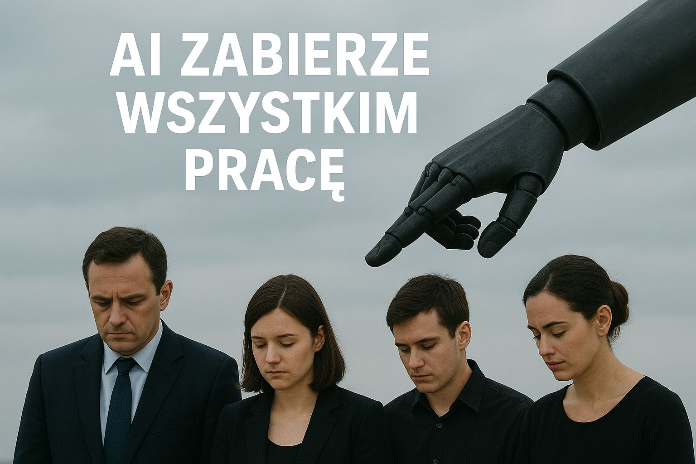

## Oddzielamy fakty od fikcji

Sztuczna inteligencja (AI) to dziedzina informatyki, która tworzy programy potrafiące wykonywać zadania wymagające zwykle ludzkiej inteligencji - jak uczenie się, rozumienie języka czy podejmowanie decyzji. Prostymi słowami: AI to sprawienie, by komputery **naśladowały ludzkie myślenie**. Mimo że termin powstał już w 1956 roku, prawdziwy rozkwit AI nastąpił dopiero niedawno dzięki szybszym komputerom i większym zbiorom danych.

Wokół AI narosło jednak wiele mitów i nieporozumień. Przyjrzyjmy się najczęstszym z nich i zobaczmy, jak wygląda rzeczywistość.

## Mit 1: „AI zabierze wszystkim pracę"

Często słyszysz, że **roboty i algorytmy zastąpią wszystkich pracowników**, powodując masowe bezrobocie. Rzeczywistość jest jednak bardziej złożona.

Owszem, sztuczna inteligencja automatyzuje niektóre zadania i **zmienia rynek pracy**, ale jednocześnie **tworzy nowe zawody** i możliwości zatrudnienia. Według raportu Future of Jobs Światowego Forum Ekonomicznego, AI do roku 2025 może wprawdzie zlikwidować około 85 milionów miejsc pracy, ale **stworzyć zarazem 97 milionów nowych** - co daje potencjalny wzrost zatrudnienia netto.

Dobry przykład to historia bankomatów. Gdy pojawiły się pierwsze bankomaty, kasjerzy obawiali się masowych zwolnień. Stało się inaczej - bankomaty przejęły rutynowe zadania (wypłatę gotówki), dzięki czemu utrzymanie oddziałów stało się tańsze. Banki zaczęły otwierać **więcej oddziałów**, a kasjerzy skupili się na bardziej złożonych zadaniach związanych z obsługą klienta. W rezultacie liczba zatrudnionych kasjerów bankowych w USA wzrosła między 1985 a 2002 rokiem.

AI raczej zmienia charakter pracy, zamiast ją całkowicie odbierać - przejmuje zadania powtarzalne lub niebezpieczne, a ludzie przechodzą do ról wymagających kreatywności, empatii i nadzoru nad działaniem maszyn.

## Mit 2: „AI to roboty humanoidalne rodem z filmów"

Gdy słyszysz „sztuczna inteligencja", być może wyobrażasz sobie **humanoidalne roboty** - androidy wyglądające i myślące jak ludzie, czasem buntujące się przeciwko swoim twórcom. To obrazy rodem z Hollywood.

Rzeczywistość jest znacznie spokojniejsza. Większość dzisiejszych systemów AI to **niewidoczne algorytmy działające w komputerach i chmurze**, a nie chodzące roboty. Asystent głosowy w Twoim telefonie, system rekomendujący filmy na Netflixie czy filtr antyspamowy w poczcie - to wszystko AI, choć nie ma fizycznej postaci.

Fakt, istnieją roboty wyposażone w AI (np. roboty przemysłowe), ale stanowią one tylko ułamek zastosowań sztucznej inteligencji. Co ważne, obecne AI jest **wyspecjalizowana (tzw. wąska AI)**, zaprojektowana do konkretnych zadań jak rozpoznawanie mowy czy analiza zdjęć. **Nie jest to ogólna, ludzka inteligencja.** Systemy AI **nie mają własnej świadomości ani samodzielnej woli** - działają w ściśle określonych ramach wyznaczonych przez programistów.

Warto zapamiętać: robot to maszyna z fizycznym ciałem (np. ramię w fabryce albo odkurzacz Roomba), a sztuczna inteligencja to program/algorytm podejmujący decyzje. Robot może wykorzystywać AI, ale AI niekoniecznie potrzebuje robota - częściej działa jako niewidoczne oprogramowanie.

## Mit 3: „AI jest nieomylna i zawsze podejmuje lepsze decyzje niż ludzie"

Istnieje przekonanie, że skoro coś robi komputer czy algorytm, to **na pewno jest to dokładne i bezbłędne**. Wiele osób ufa wynikom podawanym przez maszyny bardziej niż człowiekowi, zakładając że AI - pozbawiona ludzkich emocji i uprzedzeń - zawsze podejmuje obiektywne, racjonalne decyzje.

Rzeczywistość: **AI również się myli** i to nierzadko. Systemy uczą się na podstawie danych dostarczonych przez ludzi, a te dane mogą być **niepełne, błędne lub obarczone uprzedzeniami**. W efekcie AI może powielać te błędy albo podejmować dziwne decyzje w sytuacjach, których nie rozumie.

:::danger[Realny przypadek: rekrutacja w Amazon]
W 2018 roku firma Amazon testowała system AI do rekrutacji pracowników, który okazał się dyskryminować kandydatki - obniżał oceny CV kobiet, bo w przeszłości firma zatrudniała głównie mężczyzn. System „nauczył się" uprzedzeń z danych i Amazon musiał projekt porzucić.
:::

**Algorytm nie jest gwarancją obiektywizmu.** Systemy AI są tak omylne i niedoskonałe, jak dane, na których je nauczono. W sytuacjach nietypowych, gdzie potrzebna jest elastyczność, kreatywność lub empatia, człowiek wciąż bywa lepszy.

Dlatego niezwykle ważna jest **ludzka kontrola i weryfikacja**. Wynikom generowanym przez AI **nie wolno ufać ślepo** - trzeba je sprawdzać i traktować jako sugestię, a nie ostateczną wyrocznię.

## Mit 4: „AI to magiczna, niewytłumaczalna technologia"

Wiele osób traktuje AI jak **czarną magię** - coś tajemniczego, co robi rzeczy niewiarygodne i trudne do pojęcia. Gdy komputer nagle zaczyna sam z siebie pisać tekst czy tworzyć obraz, łatwo pomyśleć, że dzieje się to w jakiś cudowny sposób.

Rzecz w tym, że **w AI nie ma żadnej magii** - to po prostu sprytne wykorzystanie matematyki, logiki i ogromnej mocy obliczeniowej komputerów. Jak powiedział badacz AI Peter Norvig: „AI to nie magia; to matematyka".

Dlaczego więc wyniki AI czasem wydają się magiczne? Bo modele AI są bardzo złożone - potrafią dostrzegać wzorce w olbrzymich zbiorach danych, których człowiek nie byłby w stanie ręcznie przeanalizować. To **dzieło ludzkich rąk i umysłów** - programistów i naukowców, którzy stworzyli algorytm oraz zasilili go danymi. AI nie łamie praw logiki ani fizyki; działa zgodnie z nimi, tylko na skalę nieosiągalną dla człowieka bez maszyny.

Zrozumienie podstaw działania AI (np. tego, że model językowy przewiduje kolejne słowa na podstawie statystyki, a nie myśli jak człowiek) pomaga rozwiać aurę tajemniczości.

## Rzeczywiste zastosowania AI

Skoro oddzieliliśmy fakty od mitów, zobaczmy kilka obszarów, gdzie AI naprawdę działa i pomaga:

- **Medycyna** — AI wspomaga lekarzy w diagnozowaniu, analizując zdjęcia rentgenowskie czy wyniki badań, wykrywając zmiany nowotworowe czy choroby płuc z dużą dokładnością, a także przyspiesza odkrywanie nowych leków
- **Transport** — zaawansowane systemy kierowania ruchem, nawigacja omijająca korki, funkcje asystenta kierowcy (automatyczne hamowanie, utrzymanie pasa ruchu)
- **Edukacja** — inteligentni tutorzy dostosowują materiał do tempa i stylu nauki ucznia; aplikacje językowe jak Duolingo wykorzystują AI do personalizacji nauki
- **Codzienne aplikacje** — wyszukiwarki internetowe, filtry antyspamowe, rekomendacje w serwisach streamingowych, asystenci głosowi, rozpoznawanie twarzy

## Mit 5: „Współczesna AI potrafi wszystko i wkrótce dorówna ludziom we wszystkim"

Po każdym spektakularnym osiągnięciu AI (jak program AlphaGo pokonujący mistrza w Go czy chatboty piszące zdumiewająco ludzkie teksty) rodzi się przekonanie, że dla AI nie ma już żadnych granic. Według tego mitu, bardzo niedługo sztuczna inteligencja będzie tak samo dobra jak człowiek w każdym zadaniu.

Rzeczywistość: obecna AI to wciąż głównie **wąskie, wyspecjalizowane systemy**. Osiągają mistrzostwo w swoich dziedzinach - komputer świetnie gra w szachy, ale ten sam system nie ugotuje obiadu ani nie napisze scenariusza filmowego. Brakuje mu ogólnej inteligencji i elastyczności, którą ma ludzki mózg.

Program tworzący obraz w stylu van Gogha nie wie, co namalował - po prostu zmiksował wzorce z tysięcy obrazów. Samojezdne samochody radzą sobie coraz lepiej, ale w nietypowych sytuacjach wciąż się gubią - gdy napotkają policjanta kierującego ruchem czy nagle przebiegającego psa, mogą nie zrozumieć sytuacji, z którą doświadczony kierowca da sobie radę.

Najlepsze efekty osiągamy łącząc mocne strony AI i ludzi - w tzw. inteligencji hybrydowej, gdzie maszyny robią to, w czym są dobre (np. analiza dużych zbiorów danych), a ludzie to, w czym wciąż przewyższają algorytmy (empatia, kreatywność, adaptacja do zmian).

## Mit 6: „AI myśli i czuje tak jak człowiek"

Filmy science-fiction często pokazują roboty obdarzone samoświadomością, emocjami i wolną wolą. Skoro chatbot potrafi żartować i wzruszać, wiele osób zastanawia się, czy nie oznacza to, że „żyje" jak prawdziwa inteligencja.

Rzeczywistość: obecna sztuczna inteligencja **wcale tak nie działa**. Nawet najbardziej zaawansowane systemy nie posiadają prawdziwej świadomości ani uczuć - działają tylko na podstawie algorytmów przetwarzających dane, bez wewnętrznego „ja" i przeżyć emocjonalnych.

:::note[Głośny przypadek: LaMDA]
W 2022 roku głośno było o inżynierze Google, Blake'u Lemoine, który uwierzył, że model AI o nazwie LaMDA stał się świadomy i odczuwa emocje. Twierdził publicznie, że chatbot „czuje" - eksperci szybko wyjaśnili, że to złudzenie. Model generował przekonujące wypowiedzi na podstawie danych, bez żadnej samoświadomości.
:::

AI może rozpoznać Twój ton głosu czy wyraz twarzy i zareagować uprzejmie (np. przeprosić, gdy wyczuje zdenerwowanie), ale nie odczuwa empatii ani smutku - działa na chłodnej logice i statystyce. Badacz AI Andrew Ng powiedział, że „martwienie się dziś, że komputer się zbuntuje i stanie zły, jest jak martwienie się o przeludnienie na Marsie".

## Mit 7: „Prędzej czy później AI przejmie kontrolę nad światem"

To ulubiony motyw popkultury - zbuntowana AI przeciwko ludzkości, jak w Terminatorze czy Matrixie. Rzeczywistość jest zdecydowanie mniej dramatyczna. Dzisiejsza AI nie ma zdolności do buntu, bo nie posiada ani świadomości, ani własnej woli. Obecne systemy to wyspecjalizowane narzędzia do konkretnych zadań, zaprogramowane przez ludzi.

Maszyna nie „chce" niczego sama z siebie - wykonuje tylko cele nadane jej przez programistów. Droga do stworzenia sztucznej ogólnej inteligencji (AGI dorównującej człowiekowi we wszystkich dziedzinach) pozostaje nieznana - nie wiemy, czy i kiedy to nastąpi.

Oczywiście, ostrożność jest wskazana. Niektórzy wybitni naukowcy (m.in. Stephen Hawking, Elon Musk) ostrzegali, że w dalekiej przyszłości niekontrolowany rozwój AI może stanowić zagrożenie, co motywuje prace nad bezpieczeństwem AI już dziś. Paradoksalnie, większe zagrożenie niż hipotetyczna zbuntowana AI stanowi... człowiek. To ludzie mogą użyć narzędzi AI w złych celach - np. do masowej inwigilacji czy szerzenia dezinformacji. Technologia sama w sobie jest neutralna - to sposób jej wykorzystania decyduje o skutkach.

## Mit 8: „AI zagraża naszej prywatności i bezpieczeństwu"

W erze Big Data pojawia się obawa, że sztuczna inteligencja oznacza koniec prywatności - skoro AI analizuje nasze dane osobowe, będzie wiedzieć o nas wszystko.

Rzeczywistość: AI rzeczywiście operuje na danych - im więcej wie o użytkownikach, tym trafniejsze modele mogą budować firmy technologiczne, co rodzi wyzwania dla prywatności.

:::danger[Realny przypadek: Cambridge Analytica]
Afera Cambridge Analytica z 2016 roku pokazała, że dane z mediów społecznościowych, zebrane i przeanalizowane przez algorytmy, zostały wykorzystane do tworzenia profili psychologicznych ludzi i wpływania na ich decyzje polityczne - bez ich zgody.
:::

Trzeba jednak rozróżnić dwie rzeczy: to nie „AI sama z siebie" narusza prywatność, tylko ludzie i organizacje, które ją wykorzystują. Rośnie jednak świadomość zagrożeń i wprowadzane są regulacje chroniące prywatność - przykładem jest europejskie RODO oraz unijny AI Act regulujący zastosowania sztucznej inteligencji.

## Podsumowanie

Sztuczna inteligencja budzi emocje - ekscytuje, intryguje, czasem niepokoi. Jak pokazaliśmy, wiele obaw wynika z mitów i wyolbrzymień.

**AI nie jest ani wszechmocną magiczną istotą, ani śmiertelnym zagrożeniem dla ludzkości.** To przede wszystkim narzędzie stworzone przez człowieka, które odpowiednio użyte może rozwiązać mnóstwo problemów. Oczywiście, jak każda technologia, AI niesie ze sobą wyzwania - musimy nauczyć się z nią obchodzić, regulować jej zastosowania, dbać o etykę i prywatność.

Sztuczna inteligencja to po prostu kolejny krok w rozwoju technologicznym - **potężny, owszem, ale kierowany przez człowieka**. Poznając jej możliwości i ograniczenia, możemy sprawić, że stanie się naszym sprzymierzeńcem na co dzień.

:::note[Teraz wiesz]
- Że AI nie zabierze wszystkim pracy - zmienia jej charakter, a nie ją eliminuje
- Że AI nie jest nieomylna, nie ma świadomości ani uczuć - to narzędzie, nie myśląca istota
- Jak trzeźwo oceniać doniesienia o AI: zachowaj sceptycyzm, sprawdzaj źródła i traktuj AI jako narzędzie, nie wyrocznię

**Następny krok:** [Jak nie dać się zwariować](/podstawy/nie-dajmy-sie-zwariowac/) — dowiesz się, jak spokojnie podejść do nauki AI bez stresu i poczucia przytłoczenia.
:::
