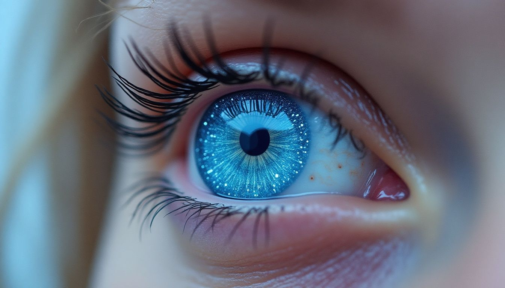

## Cześć - Twoja podróż właśnie się rozpoczyna



Witaj w kompleksowym kursie o sztucznej inteligencji. Jesteś we właściwym miejscu, niezależnie od tego, czy dopiero zaczynasz swoją przygodę z AI, czy chcesz pogłębić wiedzę w tym dynamicznie rozwijającym się obszarze.

## AI jest wszędzie - i to nie jest przesada

Sztuczna inteligencja przestała być futurystyczną koncepcją z filmów science fiction. Jest teraz częścią naszej codzienności - od asystentów głosowych w telefonach, przez systemy rekomendacji w serwisach streamingowych, po zaawansowane narzędzia analizy danych w biznesie. Boom na AI, który obserwujemy od listopada 2022 roku wraz z pojawieniem się ChatGPT, to nie chwilowa moda - to początek fundamentalnej transformacji sposobu, w jaki pracujemy, uczymy się i komunikujemy.

## Dlaczego warto poznać AI właśnie teraz?

AI nie jest już opcją - staje się koniecznością. Ta technologia zmienia rynek pracy, tworzy nowe możliwości i eliminuje rutynowe zadania. Osoby rozumiejące AI i potrafiące efektywnie z nią współpracować będą miały znaczącą przewagę w niemal każdej branży.

Nie chodzi o to, by stać się ekspertem technicznym - chodzi o zrozumienie możliwości i ograniczeń tej technologii, by móc świadomie wykorzystać ją w swojej pracy i życiu codziennym.

## Kurs stworzony z myślą o Tobie

Ten kurs powstał na bazie doświadczenia z nauką o AI - w tym, jak trudno na początku połączyć wszystkie pojęcia w spójny obraz, przedzierając się przez techniczny żargon i zawiłe koncepcje. Dlatego przygotowaliśmy ścieżkę edukacyjną skupioną na praktycznym zrozumieniu: jak działa AI, jak możesz z niej korzystać i jak uniknąć typowych pułapek - bez zagłębiania się w skomplikowane formuły matematyczne czy kod.

## Kropka po kropce - układanie pełnego obrazu

Nie martw się, jeśli na początku niektóre koncepcje będą wydawać się niejasne lub niepowiązane ze sobą. To zupełnie normalne! Uczenie się nowej dziedziny przypomina układanie puzzli - najpierw zbierasz pojedyncze elementy, a dopiero z czasem zaczynasz dostrzegać, jak tworzą one spójny obraz.

:::tip[AI jest dla wszystkich - także dla Ciebie]
AI nie jest zarezerwowana dla programistów, naukowców czy gigantów technologicznych. To narzędzie dostępne dla każdego - niezależnie od wykształcenia, zawodu czy umiejętności technicznych. Dzięki demokratyzacji dostępu do AI, którą przyniósł ChatGPT i podobne narzędzia, każdy może korzystać z jej mocy do rozwiązywania problemów, zwiększania produktywności czy rozwijania kreatywności.
:::

## Twoja mapa drogowa nauki AI

Oto ścieżka, którą przejdziesz w tym przewodniku. Każdy etap buduje na poprzednim:

| Etap | Sekcja | Cel |
| --- | --- | --- |
| **1. Podstawy** | Wstęp → Czym jest AI? → Mity vs rzeczywistość → Ograniczenia → Weryfikacja | Rozumiesz czym jest AI, znasz jej ograniczenia, potrafisz weryfikować informacje |
| **2. Jak to działa** | AI/ML/Sieci → Jak uczą się modele → LLM → Tokeny → Parametry | Rozumiesz mechanizmy - dlaczego AI "halucynuje", skąd się biorą odpowiedzi |
| **3. Prompt Engineering** | Wprowadzenie → Podstawy → Techniki → Frameworki (CO-STAR, CRISPE) → Automatyzacja | Piszesz skuteczne prompty, stosujesz zaawansowane techniki |
| **4. Narzędzia** | Chatboty → Generatory obrazów → Narzędzia specjalistyczne | Znasz ekosystem narzędzi AI i dobierasz je do zadania |
| **5. Praktyka i etyka** | AI w branżach → Najlepsze praktyki → Prywatność → Etyka | Wdrażasz AI bezpiecznie i etycznie w swojej pracy |

:::note[Kamień milowy #1: Pierwszy kontakt]
Gdy ukończysz sekcję "Podstawy" (8 stron), będziesz wiedzieć: czym jest AI, jakie ma ograniczenia, jak weryfikować informacje. To fundament całej dalszej nauki!
:::

## Twój pierwszy prompt - wypróbuj teraz!

Zanim przejdziesz dalej, wypróbuj AI w praktyce. Skopiuj poniższy prompt i wklej go do [ChatGPT](https://chat.openai.com), [Claude](https://claude.ai) lub innego chatbota AI:

```text
Jestem [Twój zawód/rola, np. "nauczycielem", "marketerem", "programistą"].

Moje największe wyzwanie w pracy to: [opisz krótko problem].

Zaproponuj 3 konkretne sposoby, jak mogę wykorzystać AI do rozwiązania tego problemu. Dla każdego sposobu podaj:
1. Co dokładnie zrobić
2. Przykładowy prompt do użycia
3. Ile czasu mogę zaoszczędzić
```

**Przykład wypełnienia:** "Jestem nauczycielem. Moje największe wyzwanie w pracy to: przygotowywanie zróżnicowanych materiałów dla uczniów o różnym poziomie."

:::tip[Właśnie zrobiłeś pierwszy krok!]
Ten prosty prompt pokazuje, jak AI może stać się Twoim osobistym asystentem. W kolejnych rozdziałach nauczysz się tworzyć jeszcze skuteczniejsze prompty.
:::

## Gotowi na start?

Stoisz u progu fascynującej podróży. Sztuczna inteligencja zmienia świat na naszych oczach, a rozumienie jej daje wgląd w przyszłość, która już się dzieje. Ten przewodnik będzie regularnie rozbudowywany o nowe podstrony, a istniejące treści aktualizowane, by odzwierciedlać szybki rozwój technologii AI - warto do niego wracać.

:::caution[Pamiętaj]
AI to potężne narzędzie, ale to Ty jesteś kapitanem statku. Obecne systemy AI, mimo swoich imponujących możliwości, wciąż potrzebują ludzkiego kierownictwa, krytycznego myślenia i etycznego nadzoru.
:::

:::note[Teraz wiesz]
- Dlaczego warto poznać AI właśnie teraz - to nie chwilowa moda, a fundamentalna zmiana w sposobie pracy i komunikacji
- Że ten kurs jest dla każdego - nie musisz być programistą ani ekspertem technicznym, by skutecznie korzystać z AI
- Że nauka AI to maraton, nie sprint - będziemy budować wiedzę krok po kroku, łącząc kolejne elementy w spójny obraz

**Następny krok:** [Czym jest AI?](/podstawy/czym-jest-ai/) — poznasz podstawowe pojęcia i zrozumiesz, czym właściwie jest sztuczna inteligencja.
:::
