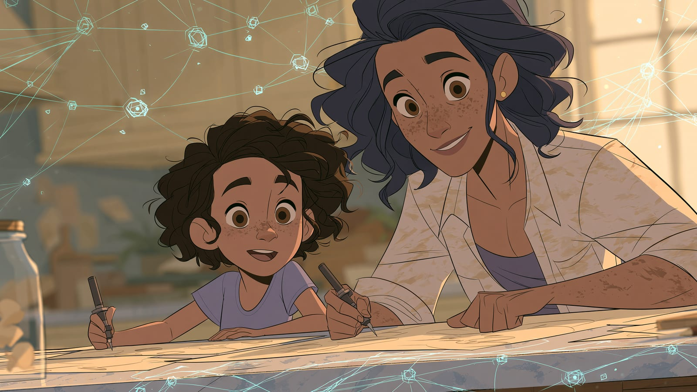

Zrozum AI, żeby mądrze towarzyszyć dziecku i dbać o jego bezpieczeństwo. Wybrałem 6 lekcji przy takim założeniu, że nie musisz zostać ekspertem - wystarczy wiedzieć na tyle dużo, żeby rozmowa w domu była rozmową, a nie zakazem.

1. [Czym jest AI?](/podstawy/czym-jest-ai/) - pojęcia, których dziecko używa na co dzień, wyłożone tak, żebyście mówili tym samym językiem.
2. [Twoja pierwsza rozmowa z AI](/podstawy/pierwsza-rozmowa-z-ai/) - załóż konto i zadaj kilka pytań samodzielnie. Trudno rozmawiać o narzędziu, którego się nie widziało od środka.
3. [Mity vs rzeczywistość AI](/podstawy/mity-vs-rzeczywistosc/) - co z tego, co się o AI mówi, jest przesadą. Przydaje się i w rozmowie z dzieckiem, i przy własnych obawach.
4. [Nie dajmy się zwariować](/podstawy/nie-dajmy-sie-zwariowac/) - rozdział o podejściu do AI bez stresu i bez FOMO. Napisany do dorosłego czytelnika, ale te same argumenty działają przy stole w kuchni.
5. [Prywatność i dane w AI](/etyka/prywatnosc/) - powiem wprost: o danych dzieci nie ma tu nic, to poradnik dla dorosłych, w dużej części o RODO w firmie. Weź z niego listę czterech kategorii danych, których nie wkleja się do czatu - i przekaż ją dalej w domu.
6. [Etyka i prawo w świecie AI](/etyka/etyczne-aspekty/) - prawa autorskie, uprzedzenia modeli i zasada mówienia wprost, że korzystało się z AI. Tematy, które prędzej czy później wrócą przy odrabianiu lekcji.

<!-- TODO(Łukasz): w całym kursie nie ma nic o danych dzieci, kontroli rodzicielskiej ani granicach wieku w narzędziach AI. Dla ścieżki rodzica to najbardziej oczekiwana treść - warto rozważyć osobną lekcję. -->

:::note[Nie ma tu nic płatnego]
Przewodnik AI jest bezpłatny w całości i taki zostanie. Gdy przejdziesz tę ścieżkę, [strona główna](/) prowadzi do pozostałych rozdziałów, a jeśli szukasz czegoś dla siebie w innej roli - [zobacz inne ścieżki](/sciezki/).
:::
